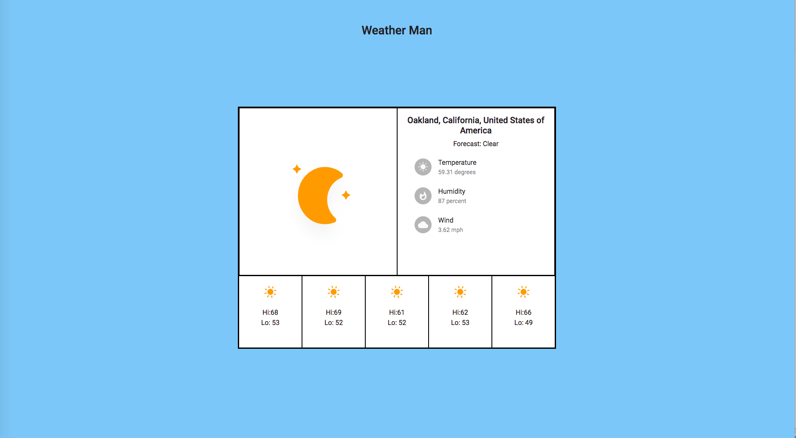

# Weather Man

## Description

This project is a local weather web application powered by OpenWeatherMap's API and locationIQ's API.

I developed this project using React.js and Redux for the frontend and Node.js / Express to create a backend server that collects user weather data.

##Download

- To run this project you must utilize Node.js in your local shell terminal.
- Once you have Node installed you can download the repo and create an env.sh file in your local weather-app directory. This file must export 3 variables: `SERVER_PORT` which you can set to 8080,\. `LOCATION_IQ_TOKEN` which is an API key you receive after signing up for LocationIQ's API service at locationiq.org,\. `OPEN_WEATHER_MAP_API_KEY` which is an API key you can receive after signing up for OpenWeatherMap's API. Once you have these two api keys and set the port to 8080 you can run the command `source env.sh` in your terminal.
- Run npm run dev to load the project. A browser window should automatically open and ask you for access to your location. Click accept and view your weather!
